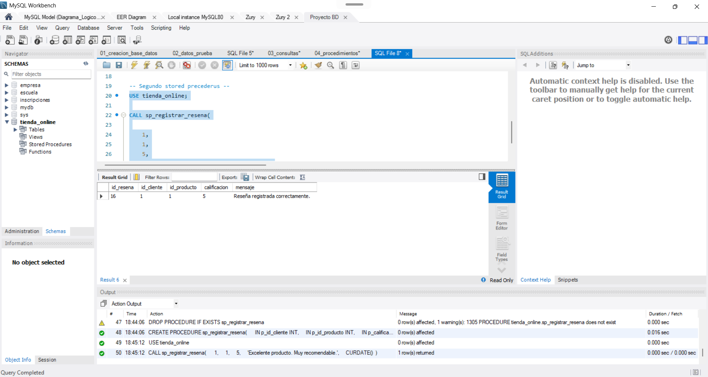
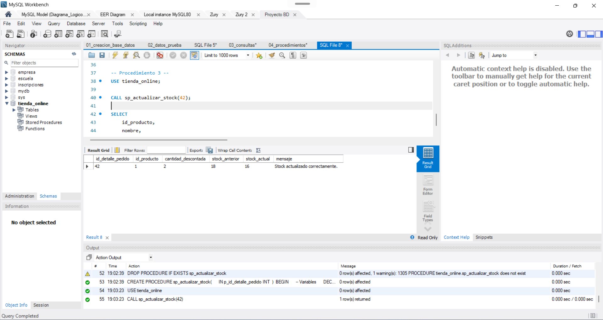
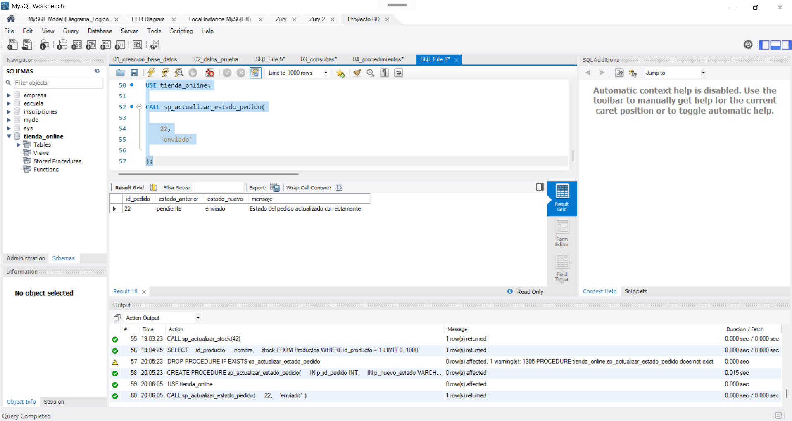
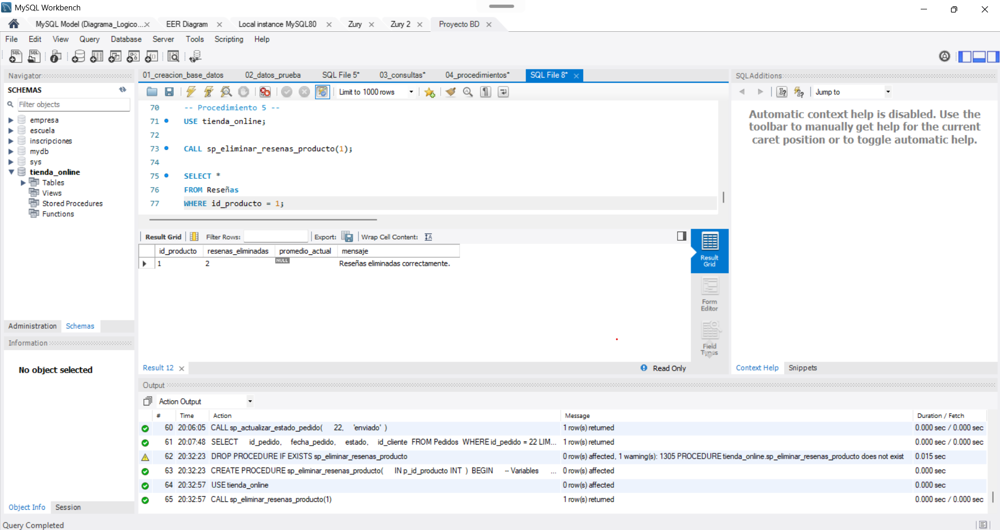
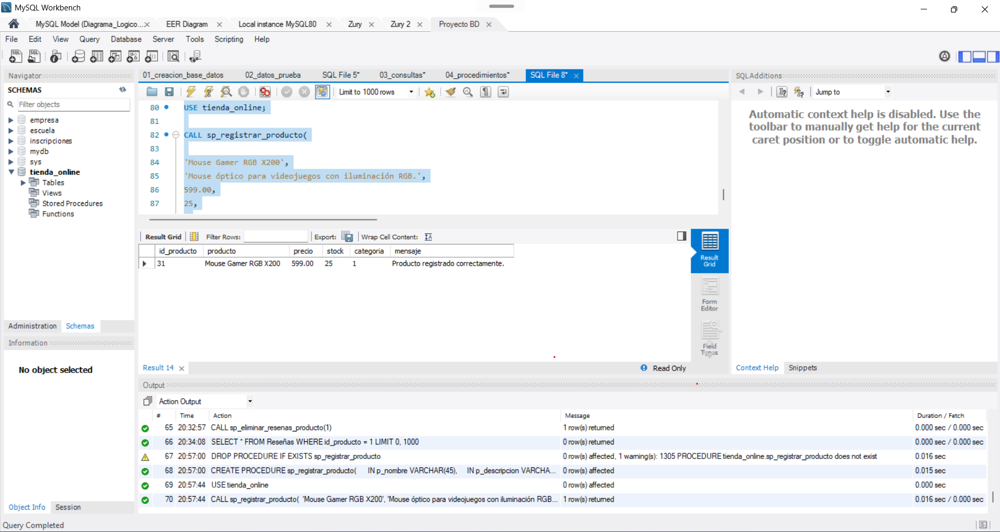
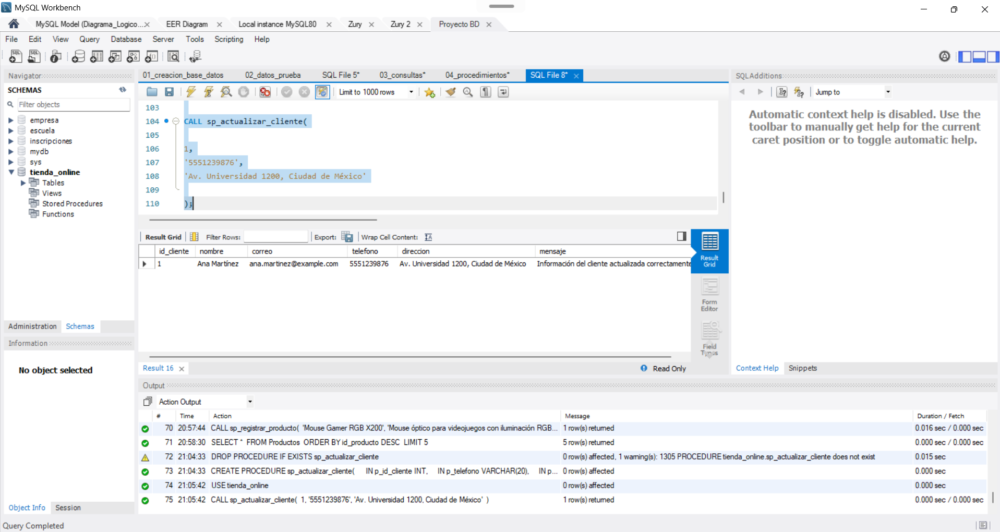
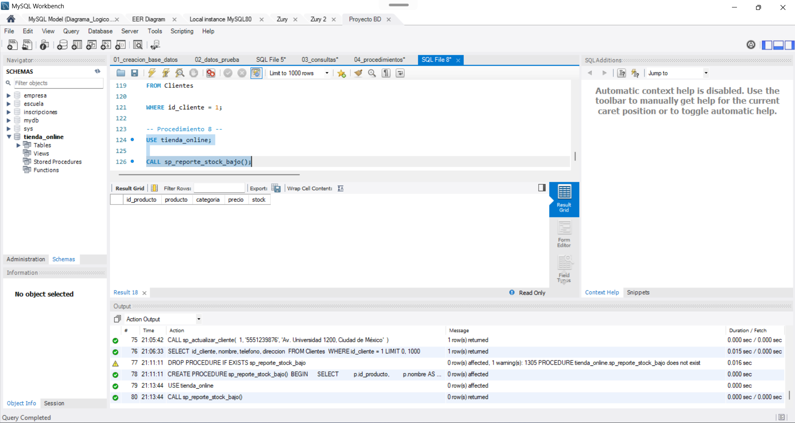

# Procedimientos Almacenados

## Introducción

Como parte de la implementación de la base de datos del sistema de gestión para la tienda en línea, se desarrollaron ocho procedimientos almacenados con el propósito de automatizar las principales operaciones del negocio y garantizar la integridad de la información.

Cada procedimiento encapsula reglas de negocio específicas, incorpora validaciones antes de modificar los datos y, cuando es necesario, utiliza transacciones para asegurar que las operaciones se ejecuten de forma atómica. En caso de producirse algún error durante la ejecución, las modificaciones realizadas son revertidas mediante la instrucción `ROLLBACK`, evitando inconsistencias en la base de datos.

Los procedimientos fueron desarrollados utilizando MySQL y posteriormente ejecutados y verificados mediante MySQL Workbench, comprobando tanto los casos de éxito como el correcto funcionamiento de las validaciones implementadas.

---

# Objetivos

Los procedimientos almacenados fueron diseñados con los siguientes objetivos:

- Automatizar las operaciones más importantes del sistema.
- Centralizar las reglas de negocio dentro del servidor de bases de datos.
- Evitar la duplicidad de código SQL.
- Garantizar la integridad de la información mediante validaciones.
- Utilizar transacciones para asegurar operaciones consistentes.
- Facilitar el mantenimiento futuro del sistema.

---

# Procedimiento almacenado 1
## Registrar un nuevo pedido

### Objetivo

Permitir el registro de un nuevo pedido realizado por un cliente verificando previamente que se cumplan todas las reglas de negocio definidas para el sistema.

### Parámetros

| Parámetro | Tipo | Descripción |
|-----------|------|-------------|
| p_id_cliente | INT | Cliente que realiza el pedido |
| p_id_producto | INT | Producto solicitado |
| p_cantidad | INT | Cantidad solicitada |

### Reglas de negocio

El procedimiento realiza las siguientes validaciones:

- El cliente debe existir.
- El producto debe existir.
- La cantidad debe ser mayor que cero.
- El cliente no puede tener cinco pedidos pendientes.
- Debe existir inventario suficiente para satisfacer la solicitud.

Una vez validadas todas las condiciones:

- Se crea un nuevo registro en la tabla **Pedidos**.
- Se crea el registro correspondiente en **Detalles_Pedido**.
- El inventario no se modifica en este procedimiento, ya que dicha responsabilidad pertenece al procedimiento encargado de actualizar el stock.

### Manejo de transacciones

El procedimiento utiliza:

- START TRANSACTION
- COMMIT
- ROLLBACK mediante un EXIT HANDLER

Además, durante la consulta del inventario se utiliza la cláusula **FOR UPDATE**, bloqueando temporalmente el registro del producto para evitar problemas de concurrencia cuando varios usuarios intentan comprar el mismo artículo simultáneamente.

### Resultado obtenido

Durante las pruebas el procedimiento registró correctamente un nuevo pedido y creó automáticamente el detalle correspondiente, devolviendo el identificador generado y el mensaje de confirmación.

**Evidencia:**

---

# Procedimiento almacenado 2
## Registrar una reseña

### Objetivo

Registrar la opinión de un cliente sobre un producto adquirido.

### Parámetros

- id del cliente
- id del producto
- calificación
- comentario
- fecha

### Reglas de negocio

Antes del registro se verifica que:

- exista el cliente;
- exista el producto;
- la calificación se encuentre entre 1 y 5;
- el cliente haya comprado previamente el producto.

Una vez cumplidas las validaciones, se registra la reseña.

### Manejo de transacciones

El procedimiento utiliza transacciones para asegurar que la inserción de la reseña se complete correctamente.

### Resultado obtenido

La reseña fue registrada exitosamente devolviendo el identificador generado y el mensaje de confirmación.

---

# Procedimiento almacenado 3
## Actualizar stock

### Objetivo

Actualizar el inventario de un producto después de que un pedido ha sido procesado.

### Reglas de negocio

Se verifica que:

- exista el detalle del pedido;
- exista stock suficiente;
- el producto asociado exista.

Posteriormente se descuenta la cantidad correspondiente del inventario.

Para evitar problemas de concurrencia también se utiliza **FOR UPDATE**, bloqueando temporalmente el registro del producto.

### Resultado obtenido

El inventario fue actualizado correctamente mostrando el stock anterior y el stock resultante.

**Evidencia:** 

---

# Procedimiento almacenado 4
## Actualizar estado del pedido

### Objetivo

Modificar el estado de un pedido durante su ciclo de vida.

### Reglas de negocio

- El pedido debe existir.
- El nuevo estado debe pertenecer al conjunto permitido:
  - pendiente
  - enviado
  - entregado
  - cancelado

### Resultado obtenido

El procedimiento modificó correctamente el estado del pedido mostrando tanto el estado anterior como el nuevo estado.

**Evidencia:**

---

# Procedimiento almacenado 5
## Eliminar reseñas de un producto

### Objetivo

Eliminar todas las reseñas asociadas a un producto determinado y recalcular el promedio de calificaciones.

### Reglas de negocio

Se verifica que:

- el producto exista;
- existan reseñas registradas para dicho producto.

Posteriormente se eliminan las reseñas y se calcula nuevamente el promedio de calificaciones restante.

### Resultado obtenido

Las reseñas fueron eliminadas correctamente y el procedimiento devolvió el número de registros eliminados.

**Evidencia:**

---

# Procedimiento almacenado 6
## Registrar un nuevo producto

### Objetivo

Agregar un nuevo producto al catálogo evitando registros duplicados.

### Reglas de negocio

Antes del registro se valida que:

- exista la categoría;
- no exista otro producto con el mismo nombre dentro de la misma categoría.

### Resultado obtenido

El nuevo producto fue registrado correctamente devolviendo su identificador.

**Evidencia:** 

---

# Procedimiento almacenado 7
## Actualizar información de un cliente

### Objetivo

Actualizar la información de contacto de un cliente.

### Reglas de negocio

Se valida únicamente que el cliente exista antes de modificar:

- teléfono;
- dirección.

### Resultado obtenido

La información fue actualizada correctamente mostrando los nuevos datos almacenados.

**Evidencia:** 

---

# Procedimiento almacenado 8
## Reporte de productos con stock bajo

### Objetivo

Generar un reporte de productos cuyo inventario sea inferior a cinco unidades.

### Funcionamiento

El procedimiento realiza una consulta entre las tablas **Productos** y **Categorías**, mostrando únicamente aquellos productos cuyo inventario es menor a cinco unidades.

Los resultados se presentan ordenados por nivel de inventario.

### Resultado obtenido

Durante las pruebas no se obtuvieron registros debido a que ningún producto presentaba inventario inferior al límite establecido, lo cual confirma el correcto funcionamiento del procedimiento.

**Evidencia:** 

---

# Conclusiones

La implementación de los ocho procedimientos almacenados permitió incorporar la lógica de negocio directamente en el servidor de bases de datos, reduciendo la posibilidad de inconsistencias y mejorando la seguridad del sistema.

Los procedimientos implementan validaciones antes de modificar la información, utilizan transacciones cuando las operaciones afectan múltiples tablas y devuelven mensajes claros sobre el resultado de cada ejecución.

Las pruebas realizadas en MySQL Workbench confirmaron el correcto funcionamiento de todos los procedimientos desarrollados, verificando tanto los casos exitosos como el cumplimiento de las principales reglas de negocio definidas para el sistema.