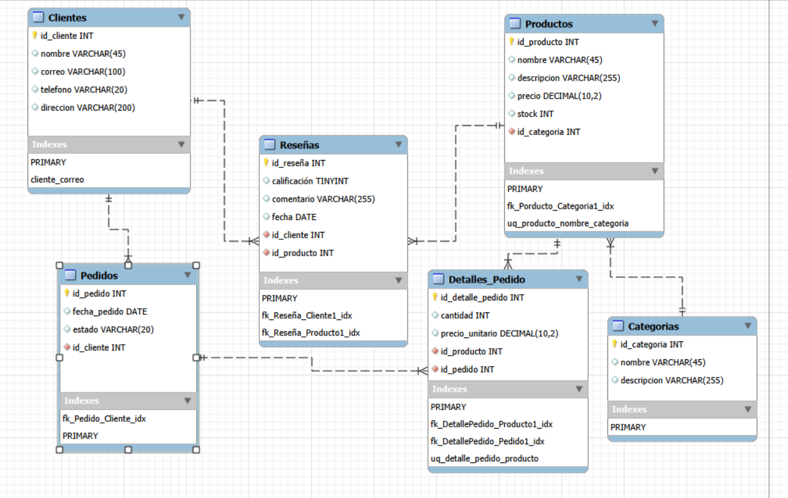
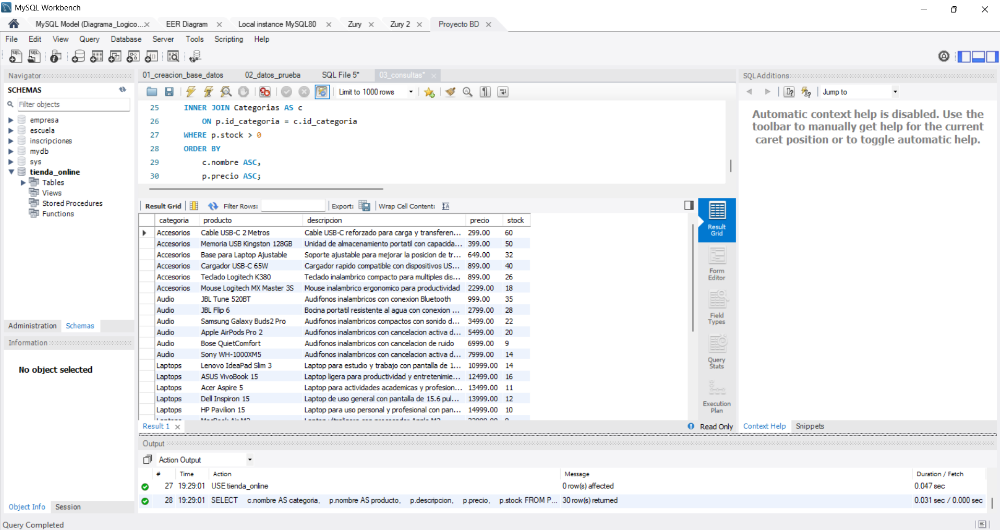
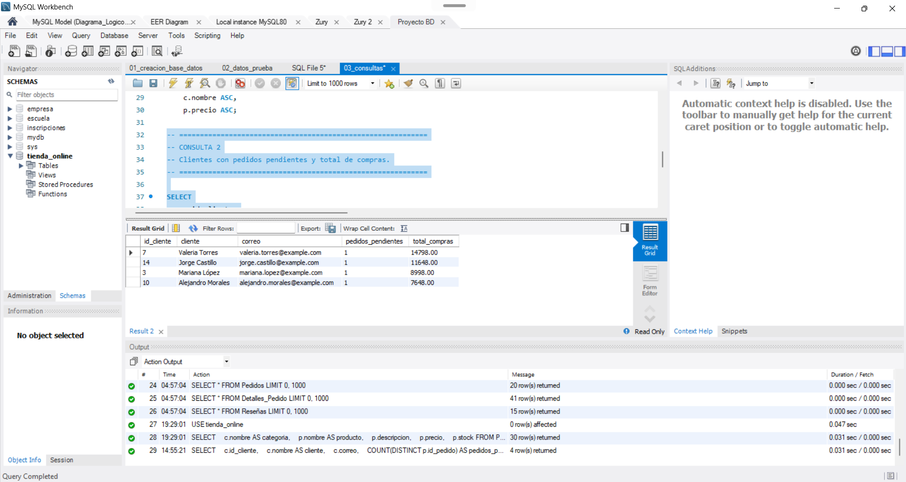
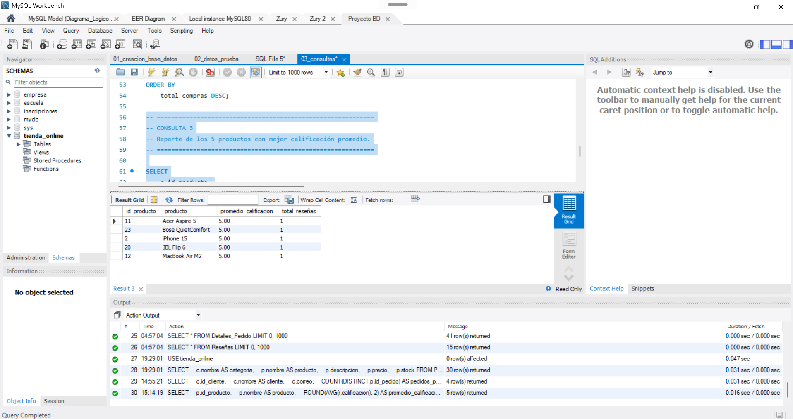
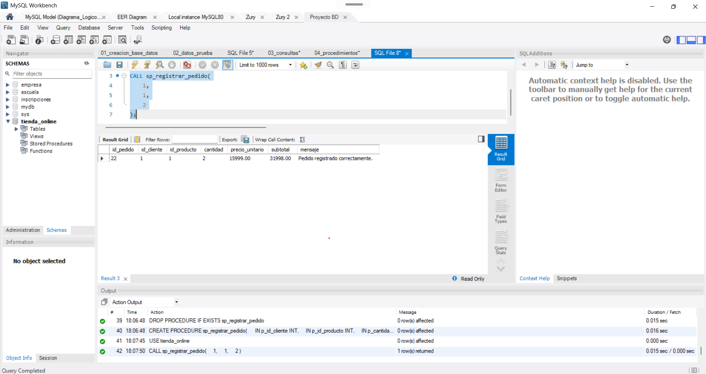
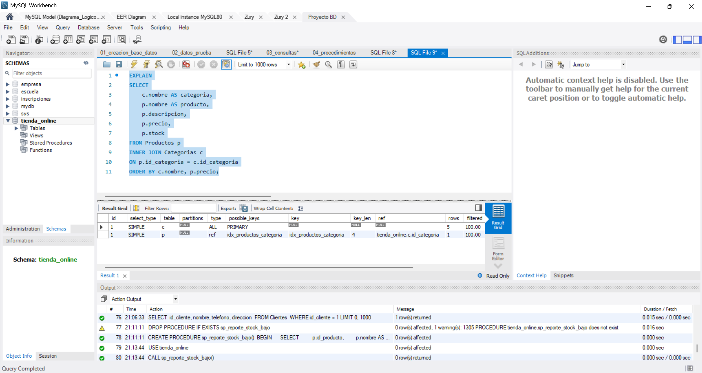
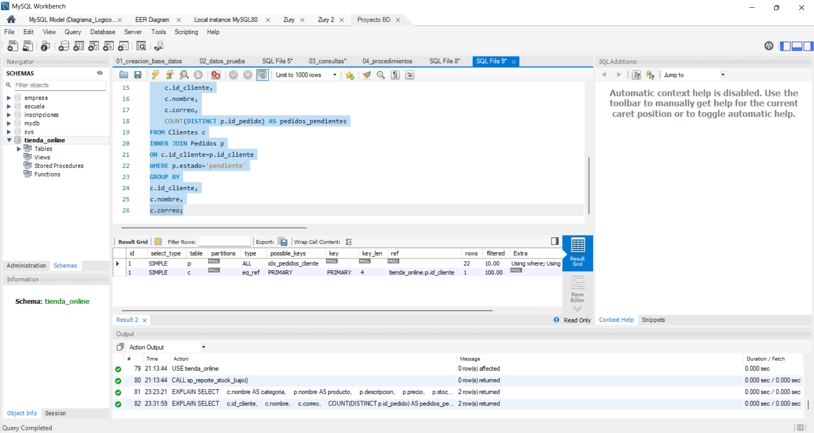
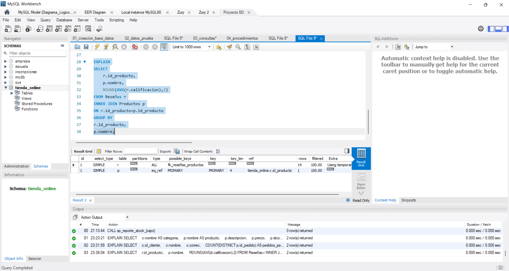
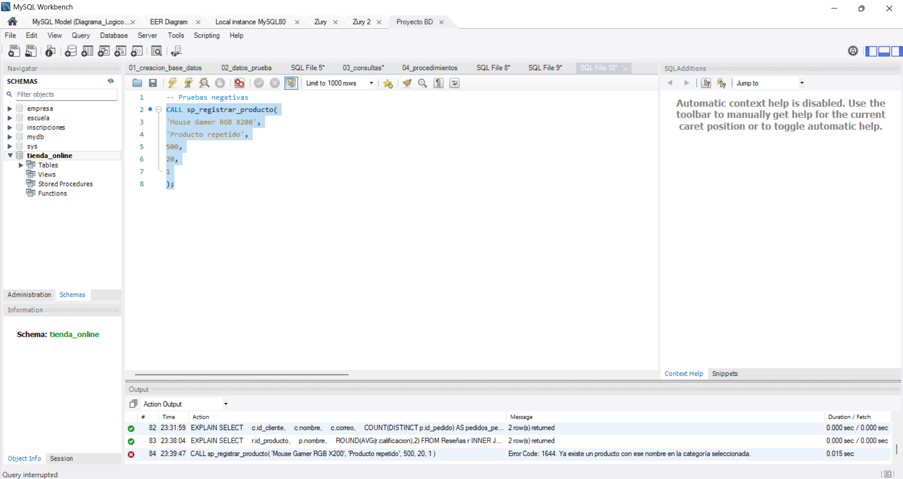
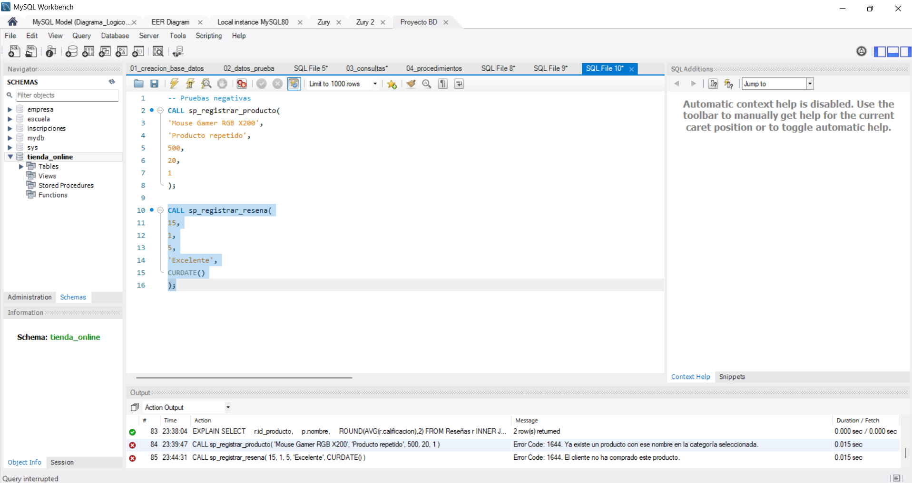

# Proyecto de Bases de Datos
# Sistema de Gestión de Tienda Online

**Universidad Autónoma Metropolitana**

**Unidad de Aprendizaje:** Bases de Datos

**Sistema Gestor de Base de Datos:** MySQL

---

# Índice

1. Introducción

2. Planteamiento del problema

3. Objetivos
   - Objetivo general
   - Objetivos específicos

4. Diseño de la Base de Datos
   - Descripción de las entidades
   - Relaciones del modelo

5. Normalización del modelo
   - Primera Forma Normal (1FN)
   - Segunda Forma Normal (2FN)
   - Tercera Forma Normal (3FN)
   - Beneficios obtenidos

6. Implementación de la Base de Datos
   - Creación de la base de datos
   - Restricciones de integridad
   - Índices implementados
   - Datos de prueba
   - Consultas SQL
   - Procedimientos almacenados

7. Scripts SQL desarrollados
   - Script de creación
   - Script de datos de prueba
   - Script de consultas
   - Script de procedimientos almacenados

8. Resultados de pruebas y análisis de rendimiento
   - Validación de consultas
   - Validación de procedimientos
   - Análisis mediante EXPLAIN
   - Escenarios negativos

9. Conclusiones

10. Lecciones aprendidas

11. Alcances del proyecto

12. Referencias

13. Anexos

# Introducción

El desarrollo de bases de datos relacionales constituye una parte fundamental dentro de los sistemas de información actuales, ya que permite organizar grandes volúmenes de datos de forma estructurada, mantener su integridad y facilitar el acceso eficiente a la información. En un entorno comercial como el de una tienda en línea, la correcta administración de los datos influye directamente en el funcionamiento de los procesos de venta, el control del inventario, la atención a los clientes y el seguimiento de los pedidos.

El presente proyecto tuvo como finalidad diseñar e implementar una base de datos para un sistema de gestión de una tienda online dedicada a la comercialización de productos electrónicos. Para ello se siguió una metodología de desarrollo dividida en varias etapas, comenzando con el análisis del problema, el diseño conceptual y lógico del modelo de datos, la normalización de las relaciones, la implementación física en MySQL, la elaboración de consultas SQL, el desarrollo de procedimientos almacenados y, finalmente, la validación y optimización del sistema mediante diferentes pruebas de funcionamiento.

A lo largo del proyecto se aplicaron los principios fundamentales del modelo relacional, respetando las restricciones de integridad y las reglas de negocio planteadas en el enunciado. Asimismo, se incorporaron índices para optimizar las consultas más frecuentes y se desarrollaron procedimientos almacenados que automatizan diversas operaciones realizadas dentro de la base de datos, garantizando la consistencia de la información y reduciendo la posibilidad de errores durante su ejecución.

El resultado obtenido corresponde a una base de datos funcional que satisface los requerimientos establecidos para la gestión de clientes, productos, categorías, pedidos y reseñas, además de proporcionar mecanismos que permiten validar reglas de negocio importantes, como el control de existencias, la prevención de productos duplicados y la restricción de reseñas únicamente para clientes que hayan adquirido previamente un producto.

# Planteamiento del problema

Actualmente muchas tiendas realizan la administración de sus productos y ventas mediante sistemas informáticos que permiten controlar cada una de las operaciones que intervienen en el proceso comercial. Sin embargo, para que estos sistemas funcionen correctamente es indispensable contar con una base de datos que garantice la integridad de la información, evite la duplicidad de registros y facilite la consulta de los datos en tiempos reducidos.

En este proyecto se abordó el diseño de una base de datos para una tienda online de productos electrónicos, considerando la administración de clientes, productos, categorías, pedidos, detalles de pedido y reseñas de productos. Además de almacenar la información, el sistema debía incorporar diversas reglas de negocio que aseguraran el correcto funcionamiento de las operaciones, entre ellas impedir que un cliente acumulara más de cinco pedidos pendientes, evitar registrar productos duplicados dentro de una misma categoría y permitir la creación de reseñas únicamente cuando existiera una compra previa del producto.

Para resolver esta problemática fue necesario aplicar las diferentes etapas del diseño de bases de datos relacionales, comenzando por el análisis de los requerimientos, seguido del diseño conceptual, el diseño lógico y la normalización de las entidades. Posteriormente se implementó el modelo en MySQL, incorporando restricciones, índices y procedimientos almacenados que fortalecen la integridad y el rendimiento de la base de datos.

# Objetivos

## Objetivo general

Diseñar, implementar y validar una base de datos relacional para un sistema de gestión de una tienda online de productos electrónicos utilizando MySQL, aplicando los principios de normalización, integridad referencial y optimización mediante índices y procedimientos almacenados.

## Objetivos específicos

- Analizar los requerimientos funcionales del sistema para identificar las entidades, atributos y relaciones que forman parte del modelo de datos.

- Diseñar el modelo entidad-relación y transformarlo en un modelo lógico normalizado hasta la Tercera Forma Normal.

- Implementar la base de datos en MySQL utilizando claves primarias, claves foráneas, restricciones de integridad e índices de optimización.

- Poblar la base de datos con información de prueba que permita validar el correcto funcionamiento del sistema.

- Desarrollar consultas SQL que satisfagan las necesidades de información planteadas en el proyecto.

- Implementar procedimientos almacenados que automaticen operaciones frecuentes y garanticen el cumplimiento de las reglas de negocio.

- Evaluar el desempeño de la base de datos mediante el uso del comando EXPLAIN y diferentes escenarios de prueba.

- Documentar todas las etapas del desarrollo para facilitar la comprensión, mantenimiento y futura evolución del proyecto.

# Diseño de la Base de Datos

Una vez identificados los requerimientos del sistema, se procedió al diseño de la base de datos siguiendo el modelo relacional. El objetivo principal fue representar correctamente las entidades que participan en el funcionamiento de una tienda en línea, procurando evitar redundancia de información y mantener la integridad de los datos mediante relaciones bien definidas.

El modelo final quedó conformado por seis entidades principales: **Clientes**, **Productos**, **Categorías**, **Pedidos**, **Detalles_Pedido** y **Reseñas**. Cada una de ellas cumple una función específica dentro del sistema y, en conjunto, permiten representar el proceso completo de compra, desde el registro del cliente hasta la generación de una reseña del producto adquirido.

A continuación se presenta el diagrama entidad-relación implementado en MySQL Workbench.



## Entidad Clientes

La entidad **Clientes** almacena la información correspondiente a las personas registradas dentro del sistema. Cada cliente cuenta con un identificador único que funciona como clave primaria y permite relacionarlo con los pedidos y las reseñas que realiza posteriormente.

Además del identificador, se registran datos básicos como el nombre, correo electrónico, número telefónico y dirección. El correo electrónico posee una restricción de unicidad, ya que dos clientes no pueden compartir la misma cuenta de correo.

Esta entidad representa el punto de partida de la mayoría de las operaciones realizadas dentro de la base de datos.

## Entidad Categorías

La entidad **Categorías** permite organizar los productos de acuerdo con su tipo o clasificación comercial. Cada categoría posee un identificador único, un nombre y una descripción que facilitan la administración del catálogo de productos.

La existencia de esta entidad evita repetir constantemente la categoría dentro de cada producto y permite mantener una estructura más flexible para futuras ampliaciones del sistema.

## Entidad Productos

La entidad **Productos** almacena la información comercial de los artículos disponibles para la venta.

Cada producto contiene su nombre, descripción, precio, cantidad disponible en inventario y la categoría a la que pertenece mediante una clave foránea.

Para evitar registros duplicados se implementó una restricción de unicidad formada por el nombre del producto y la categoría, permitiendo que un mismo nombre únicamente exista una vez dentro de la misma categoría.

Asimismo, el campo correspondiente al stock resulta fundamental para controlar la disponibilidad de los productos y facilitar el seguimiento del inventario.

## Entidad Pedidos

La entidad **Pedidos** registra las compras realizadas por los clientes.

Cada pedido almacena la fecha en la que fue generado, el estado actual del proceso de compra y el cliente que lo realizó mediante una clave foránea.

La relación establecida entre Clientes y Pedidos es de uno a muchos, debido a que un cliente puede generar múltiples pedidos, mientras que cada pedido únicamente pertenece a un solo cliente.

Esta estructura facilita el seguimiento histórico de las compras realizadas por cada usuario.

## Entidad Detalles_Pedido

La entidad **Detalles_Pedido** resuelve la relación de muchos a muchos existente entre Pedidos y Productos.

Cada registro representa un producto específico incluido dentro de un pedido, indicando la cantidad adquirida y el precio unitario correspondiente al momento de la compra.

Gracias a esta entidad es posible que un pedido contenga varios productos y, al mismo tiempo, que un mismo producto pueda formar parte de distintos pedidos sin duplicar información.

Adicionalmente se implementó una restricción de unicidad para impedir que un mismo producto sea registrado más de una vez dentro del mismo pedido.

## Entidad Reseñas

La entidad **Reseñas** almacena las opiniones emitidas por los clientes sobre los productos adquiridos.

Cada reseña contiene una calificación numérica, un comentario, la fecha en que fue registrada, así como las claves foráneas que la relacionan tanto con el cliente como con el producto correspondiente.

Durante la implementación se desarrolló un procedimiento almacenado encargado de validar que únicamente los clientes que realmente hayan comprado un producto puedan registrar una reseña, garantizando así la consistencia de la información almacenada.

## Relaciones del modelo

Las relaciones implementadas dentro de la base de datos son las siguientes:

- Un cliente puede realizar varios pedidos, mientras que cada pedido pertenece únicamente a un cliente.

- Una categoría puede contener múltiples productos, aunque cada producto pertenece solamente a una categoría.

- Un pedido puede incluir varios productos y un mismo producto puede aparecer en diferentes pedidos. Esta relación se resolvió mediante la entidad Detalles_Pedido.

- Un cliente puede escribir varias reseñas y un producto puede recibir múltiples reseñas de distintos clientes.

Todas estas relaciones fueron implementadas mediante claves foráneas, permitiendo mantener la integridad referencial durante todas las operaciones realizadas sobre la base de datos.

# Normalización del modelo

Una vez definido el modelo entidad-relación, se realizó el proceso de normalización con el propósito de eliminar redundancias, evitar anomalías durante las operaciones de inserción, actualización y eliminación, así como garantizar la consistencia de la información almacenada.

Durante esta etapa se revisó cada una de las entidades propuestas, verificando que todos los atributos dependieran únicamente de su clave primaria y que no existieran dependencias parciales ni transitivas. Como resultado, el modelo final quedó normalizado hasta la **Tercera Forma Normal (3FN)**.

## Primera Forma Normal (1FN)

El modelo cumple con la Primera Forma Normal debido a que todas las tablas almacenan valores atómicos y cada atributo contiene un único dato por registro. Asimismo, todas las entidades poseen una clave primaria que identifica de manera única cada fila, lo que evita la existencia de grupos repetitivos o atributos multivaluados.

Por ejemplo, la información correspondiente a los productos adquiridos dentro de un pedido no se almacena en una sola columna, sino que se representa mediante la entidad **Detalles_Pedido**, permitiendo registrar un producto por cada fila.

## Segunda Forma Normal (2FN)

La Segunda Forma Normal se cumple porque todos los atributos no clave dependen completamente de la clave primaria de cada entidad.

En aquellas relaciones donde originalmente existía una dependencia de muchos a muchos, como ocurre entre pedidos y productos, se creó la tabla **Detalles_Pedido**, la cual contiene información propia de cada producto incluido en una compra, como la cantidad adquirida y el precio unitario. De esta manera se eliminaron las dependencias parciales que habrían existido si toda esta información permaneciera dentro de la tabla de pedidos.

## Tercera Forma Normal (3FN)

El modelo también satisface la Tercera Forma Normal debido a que no existen dependencias transitivas entre atributos que no forman parte de la clave primaria.

La información correspondiente a clientes, productos, categorías, pedidos y reseñas se encuentra distribuida en entidades independientes, evitando almacenar datos repetidos en diferentes tablas. Cada entidad conserva únicamente los atributos que describen directamente al objeto que representa, mientras que las relaciones entre ellas se establecen mediante claves foráneas.

Gracias a esta organización fue posible mantener un diseño consistente, flexible y fácil de mantener, reduciendo considerablemente la duplicidad de información.

## Beneficios obtenidos

La normalización aplicada durante el desarrollo del proyecto aportó diversas ventajas al diseño de la base de datos, entre las cuales destacan:

- Reducción de la redundancia de información.
- Eliminación de anomalías durante las operaciones de inserción, actualización y eliminación.
- Mayor facilidad para mantener la integridad referencial.
- Mejor organización lógica de las entidades.
- Mayor escalabilidad para incorporar nuevas funcionalidades sin modificar la estructura principal del modelo.

En conjunto, estas características permitieron obtener una base de datos consistente y preparada para soportar las operaciones implementadas posteriormente mediante consultas SQL, índices y procedimientos almacenados.

# Implementación de la Base de Datos

Concluido el proceso de diseño y normalización, se procedió a implementar físicamente la base de datos utilizando MySQL como sistema gestor de bases de datos y MySQL Workbench como herramienta de desarrollo.

La implementación se realizó de manera progresiva, comenzando con la creación del esquema de la base de datos y continuando con la definición de las tablas, las relaciones entre entidades, las restricciones de integridad y los índices necesarios para optimizar las consultas más frecuentes. Posteriormente se incorporaron registros de prueba con el propósito de verificar el correcto funcionamiento de cada uno de los componentes desarrollados.

Una vez concluida la implementación física de la base de datos, se desarrollaron los distintos scripts SQL que permiten crear completamente el sistema, poblar la información de prueba, ejecutar las consultas solicitadas y automatizar diversas operaciones mediante procedimientos almacenados. La descripción de cada uno de estos scripts se presenta en el apartado siguiente.

## Creación de la base de datos

La implementación comenzó con la creación de la base de datos **tienda_online**, la cual funciona como contenedor de todas las entidades del sistema.

Posteriormente se definieron las seis tablas que conforman el modelo relacional:

- Clientes
- Categorías
- Productos
- Pedidos
- Detalles_Pedido
- Reseñas

Cada una de estas tablas fue creada respetando la estructura obtenida durante el diseño lógico, conservando sus claves primarias y las relaciones establecidas mediante claves foráneas.

## Restricciones de integridad

Con el objetivo de mantener la consistencia de la información, durante la implementación se incorporaron diferentes restricciones sobre las tablas del sistema.

Entre las más importantes se encuentran las siguientes:

- Claves primarias para identificar de manera única cada registro.
- Claves foráneas para garantizar la integridad referencial entre las entidades.
- Restricción UNIQUE sobre el correo electrónico de los clientes.
- Restricción UNIQUE sobre la combinación del nombre del producto y su categoría, evitando productos duplicados.
- Restricción UNIQUE sobre la combinación del pedido y el producto dentro de la tabla Detalles_Pedido, impidiendo registrar dos veces el mismo producto en un mismo pedido.

Estas restricciones permiten mantener una estructura consistente y reducen considerablemente la posibilidad de introducir información incorrecta.

## Índices implementados

Además de las restricciones, se incorporaron diversos índices con la finalidad de optimizar el acceso a la información.

Los índices fueron creados principalmente sobre las claves foráneas utilizadas con mayor frecuencia en las consultas SQL y en los procedimientos almacenados.

Entre ellos destacan:

- Índice sobre la relación entre Productos y Categorías.
- Índice sobre la relación entre Pedidos y Clientes.
- Índices sobre las relaciones existentes en la tabla Reseñas.
- Índices sobre las relaciones entre Detalles_Pedido, Productos y Pedidos.

Durante la fase de validación se comprobó mediante el comando **EXPLAIN** que MySQL utiliza estos índices durante la ejecución de diferentes consultas, reduciendo la cantidad de registros analizados y mejorando el rendimiento general del sistema.

## Datos de prueba

Con el propósito de validar el funcionamiento de la base de datos se generó un conjunto de datos representativo que permitió simular el comportamiento de una tienda en línea.

Los datos incluyen clientes registrados, categorías de productos, artículos disponibles para la venta, pedidos con distintos estados, detalles de compra y reseñas emitidas por los clientes.

La información fue diseñada para permitir la ejecución de consultas complejas y probar los procedimientos almacenados bajo diferentes escenarios, tanto exitosos como de error.

## Consultas SQL

Como parte del desarrollo se implementó un conjunto de consultas SQL orientadas a responder diferentes necesidades de información del sistema.

Estas consultas permiten obtener reportes relacionados con los productos disponibles, los pedidos realizados por los clientes, las calificaciones promedio de los productos y otros indicadores útiles para la administración de la tienda.

Cada consulta fue validada utilizando los datos de prueba generados durante la implementación y sus resultados se documentan dentro del apartado correspondiente a las pruebas realizadas.

## Procedimientos almacenados

Con la finalidad de automatizar diversas operaciones sobre la base de datos se desarrollaron ocho procedimientos almacenados que incorporan validaciones y reglas de negocio definidas para el sistema.

Entre las operaciones implementadas se encuentran el registro de pedidos, la creación de reseñas, la actualización del inventario, la modificación del estado de los pedidos, la eliminación de reseñas, el registro de nuevos productos evitando duplicados, la actualización de información de clientes y la generación de reportes de productos con bajo inventario.

Cada procedimiento fue probado utilizando distintos escenarios de ejecución, incluyendo casos exitosos y pruebas negativas que permitieron comprobar el correcto funcionamiento de las validaciones implementadas.

La documentación completa de los procedimientos almacenados, incluyendo su objetivo, parámetros, funcionamiento y ejemplos de ejecución, puede consultarse en el documento **06_Procedimientos_almacenados.md**.


# Scripts SQL desarrollados

| Script | Descripción |
|---------|-------------|
| 01_creacion_base_datos.sql | Crea la estructura completa de la base de datos. |
| 02_datos_prueba.sql | Inserta los registros utilizados para las pruebas. |
| 03_consultas.sql | Contiene las consultas solicitadas en el proyecto. |
| 04_procedimientos.sql | Incluye los ocho procedimientos almacenados implementados. |

Con el propósito de facilitar la instalación, mantenimiento y reutilización de la base de datos, el desarrollo del proyecto fue organizado en distintos scripts SQL independientes, cada uno orientado a una función específica dentro del sistema.

Esta organización permite recrear completamente la base de datos desde cero, poblarla con datos de prueba, ejecutar las consultas requeridas y disponer de todos los procedimientos almacenados desarrollados durante el proyecto sin necesidad de realizar modificaciones adicionales.

## Script de creación de la base de datos

El archivo **01_creacion_base_datos.sql** contiene todas las instrucciones necesarias para crear la base de datos desde cero.

Entre las principales operaciones implementadas se encuentran:

- creación de la base de datos;
- creación de las seis tablas;
- definición de claves primarias;
- definición de claves foráneas;
- restricciones de integridad;
- restricciones UNIQUE;
- creación de índices.

Este script constituye la base estructural del sistema y puede ejecutarse sobre una instalación limpia de MySQL.

### Fragmento representativo del script

A continuación se muestra un fragmento del script encargado de crear una de las entidades principales de la base de datos.

```sql
CREATE TABLE Clientes (
    id_cliente INT AUTO_INCREMENT PRIMARY KEY,
    nombre VARCHAR(100) NOT NULL,
    correo VARCHAR(100) UNIQUE NOT NULL,
    telefono VARCHAR(20),
    direccion VARCHAR(255)
);
```

Este fragmento ilustra la definición de una tabla utilizando una clave primaria, restricciones de integridad y atributos necesarios para almacenar la información de los clientes. El script completo puede consultarse en el archivo **01_creacion_base_datos.sql** ubicado dentro del directorio **SQL/Scripts** del repositorio.

---

## Script de datos de prueba

El archivo **02_datos_prueba.sql** incorpora la información necesaria para validar el funcionamiento de la base de datos.

Los datos incluyen:

- clientes;
- categorías;
- productos;
- pedidos;
- detalles de pedido;
- reseñas.

El conjunto de registros fue diseñado para permitir la ejecución de consultas, procedimientos almacenados y pruebas de rendimiento.

### Fragmento representativo del script

El siguiente ejemplo muestra la inserción de información inicial utilizada para validar el funcionamiento del sistema.

```sql
INSERT INTO Categorias (nombre, descripcion)
VALUES
('Laptops', 'Computadoras portátiles'),
('Monitores', 'Pantallas para computadora');
```

Este tipo de registros permitió ejecutar consultas, validar relaciones entre tablas y probar los procedimientos almacenados desarrollados durante el proyecto. El conjunto completo de datos puede consultarse en el archivo **02_datos_prueba.sql**.

---

## Script de consultas SQL

El archivo **03_consultas.sql** reúne las tres consultas solicitadas dentro del proyecto.

Las consultas implementadas permiten:

- listar productos por categoría;
- consultar clientes con pedidos pendientes;
- generar el reporte de productos con mejor calificación promedio.

Todas ellas fueron ejecutadas utilizando los datos de prueba y posteriormente validadas durante la etapa de pruebas.

### Fragmento representativo del script

El siguiente fragmento corresponde a una de las consultas desarrolladas para obtener productos agrupados por categoría.

```sql
SELECT
    c.nombre AS categoria,
    p.nombre AS producto,
    p.precio
FROM Productos p
INNER JOIN Categorias c
    ON p.id_categoria = c.id_categoria
ORDER BY c.nombre, p.precio;
```

Las consultas desarrolladas permiten obtener información relevante para la administración de la tienda y fueron verificadas utilizando los datos de prueba. El código completo se encuentra disponible en el archivo **03_consultas.sql**.

---

## Script de procedimientos almacenados

El archivo **04_procedimientos.sql** contiene los ocho procedimientos almacenados desarrollados durante el proyecto.

Los ocho procedimientos almacenados fueron ejecutados utilizando diferentes escenarios de prueba con el propósito de validar tanto su funcionamiento normal como el cumplimiento de las reglas de negocio implementadas.

Aunque en este apartado únicamente se presenta una descripción general del contenido del script, la documentación técnica detallada de cada procedimiento almacenado —incluyendo su objetivo, parámetros, funcionamiento, validaciones implementadas, ejemplos de ejecución y evidencias obtenidas durante las pruebas— se encuentra en el documento **06_Procedimientos_almacenados.md**, el cual forma parte de la documentación del proyecto.

Entre las principales funcionalidades implementadas destacan:

- registro de pedidos;
- registro de reseñas;
- actualización del inventario;
- cambio de estado de pedidos;
- eliminación de reseñas;
- registro de nuevos productos;
- actualización de clientes;
- generación de reportes de inventario.

Todos los procedimientos fueron ejecutados y documentados mediante pruebas realizadas en MySQL Workbench.

### Fragmento representativo del script

El siguiente ejemplo corresponde al inicio del procedimiento almacenado encargado de registrar un nuevo pedido.

```sql
CREATE PROCEDURE sp_registrar_pedido(...)
BEGIN

    START TRANSACTION;

    -- Validaciones y operaciones

    COMMIT;

END;
```

Los procedimientos almacenados desarrollados incorporan validaciones, manejo de transacciones y reglas de negocio para automatizar las operaciones más importantes del sistema. La implementación completa puede consultarse en el archivo **04_procedimientos.sql**.

# Resultados de pruebas y análisis de rendimiento

| Tipo de validación | Resultado |
|--------------------|-----------|
| Consultas SQL | Correctas |
| Procedimientos almacenados | Correctos |
| Restricciones de integridad | Correctas |
| Índices | Utilizados mediante EXPLAIN |
| Escenarios negativos | Validados |

Después de concluir la implementación del sistema se llevó a cabo una etapa de validación cuyo objetivo consistió en comprobar el correcto funcionamiento de todas las consultas SQL, los procedimientos almacenados y las restricciones implementadas durante el desarrollo del proyecto. Asimismo, se evaluó el comportamiento de los índices creados mediante la herramienta EXPLAIN de MySQL, con el propósito de analizar el rendimiento de las consultas más representativas.

Las pruebas se realizaron utilizando los datos de prueba registrados previamente en la base de datos y fueron ejecutadas desde MySQL Workbench. Para cada consulta y procedimiento almacenado se verificó tanto el resultado obtenido como el estado final de las tablas involucradas, asegurando que las operaciones modificaran únicamente la información esperada.

## Validación de consultas SQL

Las tres consultas desarrolladas durante el proyecto fueron ejecutadas utilizando la información almacenada en la base de datos.

La primera consulta permitió listar los productos disponibles agrupados por categoría y ordenados por precio, facilitando la consulta del catálogo de productos y comprobando el correcto funcionamiento de la relación entre las tablas **Productos** y **Categorías**.

La segunda consulta mostró los clientes que cuentan con pedidos pendientes, junto con la cantidad de compras registradas para cada uno de ellos. Esta prueba confirmó que la relación entre **Clientes** y **Pedidos** fue implementada correctamente y que las funciones de agregación producen resultados consistentes.

Finalmente, la tercera consulta generó un reporte con los productos mejor calificados utilizando la información almacenada en la tabla **Reseñas**. Para ello se calculó el promedio de las calificaciones mediante la función **AVG()**, verificando además la correcta relación entre productos y reseñas.

Las tres consultas devolvieron resultados coherentes con la información registrada en la base de datos, confirmando que el modelo relacional implementado satisface las necesidades de consulta planteadas durante el proyecto.

**Evidencias**

### Consulta 1. Productos disponibles por categoría

La siguiente captura muestra el resultado obtenido al ejecutar la primera consulta, en la cual se listan los productos disponibles agrupados por categoría y ordenados por precio.



---

### Consulta 2. Clientes con pedidos pendientes

La siguiente evidencia corresponde a la segunda consulta desarrollada durante el proyecto, la cual permite identificar los clientes que cuentan con pedidos pendientes y el total de compras registradas.



---

### Consulta 3. Productos con mejor calificación promedio

En la siguiente imagen se observa el resultado de la consulta encargada de calcular el promedio de calificaciones de los productos registrados mediante las reseñas de los clientes.



---

## Validación de los procedimientos almacenados

Cada uno de los ocho procedimientos almacenados fue ejecutado utilizando distintos escenarios de prueba con el objetivo de comprobar tanto su funcionamiento normal como el cumplimiento de las reglas de negocio implementadas.

Durante las pruebas se verificó que el procedimiento encargado de registrar pedidos respetara el límite máximo de pedidos pendientes por cliente y validara la disponibilidad del inventario antes de crear un nuevo pedido.

También se comprobó que el procedimiento para registrar reseñas únicamente permitiera almacenar opiniones de clientes que previamente hubieran adquirido el producto correspondiente, evitando así reseñas no autorizadas.

Los procedimientos relacionados con la actualización del inventario, el cambio de estado de los pedidos, el registro de nuevos productos, la actualización de clientes y la eliminación de reseñas fueron ejecutados correctamente, verificando posteriormente el contenido de las tablas para confirmar que las modificaciones se realizaron conforme a lo esperado.

Finalmente, el procedimiento destinado a generar el reporte de productos con bajo inventario permitió comprobar que la consulta devuelve únicamente aquellos productos cuyo stock es inferior al límite establecido.

Cada procedimiento fue documentado mediante capturas de pantalla que muestran tanto la ejecución del procedimiento como la verificación posterior de la información almacenada.


**Evidencias**

La siguiente captura corresponde a una de las ejecuciones realizadas durante la validación de los procedimientos almacenados. Como puede observarse, el procedimiento ejecuta correctamente la operación solicitada y devuelve un mensaje indicando que la transacción fue realizada exitosamente.

Las pruebas completas de los ocho procedimientos almacenados, incluyendo los diferentes escenarios de ejecución y las verificaciones posteriores sobre las tablas de la base de datos, pueden consultarse en el documento **06_Procedimientos_almacenados.md**.



---

## Análisis del rendimiento mediante EXPLAIN

Como parte de la etapa de optimización se analizaron las principales consultas utilizando la instrucción **EXPLAIN** de MySQL.

Esta herramienta permitió conocer el plan de ejecución seleccionado por el optimizador y verificar el uso de los índices implementados durante la creación de la base de datos.

En la primera consulta se observó el uso del índice asociado a la relación entre productos y categorías, reduciendo el número de registros inspeccionados para localizar los productos pertenecientes a cada categoría.

En la segunda consulta MySQL aprovechó el índice correspondiente a la relación entre clientes y pedidos, optimizando la ejecución del JOIN y disminuyendo el costo de acceso a la información.

Para la tercera consulta el optimizador utilizó el índice asociado a la relación entre productos y reseñas. Aunque el cálculo del promedio requiere una operación de agregación, el acceso a los registros relacionados continúa realizándose mediante índices, mejorando el rendimiento de la consulta.

Los resultados obtenidos mediante EXPLAIN confirmaron que los índices implementados cumplen correctamente su propósito y contribuyen a disminuir el costo de ejecución de las consultas analizadas.

**Evidencias**

### EXPLAIN de la Consulta 1

La siguiente imagen muestra el plan de ejecución generado por MySQL para la primera consulta.



---

### EXPLAIN de la Consulta 2

En esta captura se observa el plan de ejecución correspondiente a la segunda consulta.



---

### EXPLAIN de la Consulta 3

La siguiente evidencia corresponde al análisis realizado sobre la tercera consulta utilizando la instrucción EXPLAIN.



---

## Pruebas de escenarios negativos

Además de verificar el funcionamiento normal del sistema, se realizaron pruebas orientadas a comprobar que las restricciones implementadas dentro de los procedimientos almacenados impidieran operaciones que violaran las reglas de negocio.

Uno de los escenarios evaluados consistió en intentar registrar un producto con el mismo nombre y la misma categoría de un producto previamente existente. El procedimiento detectó correctamente el duplicado y devolvió un mensaje de error, evitando la inserción del nuevo registro.

También se ejecutó una prueba en la que un cliente intentó registrar una reseña sobre un producto que nunca había comprado. En este caso el procedimiento almacenado rechazó la operación y notificó que el cliente no cumplía con la condición necesaria para registrar la reseña.

Estas pruebas demostraron que las validaciones implementadas dentro de los procedimientos almacenados funcionan correctamente y contribuyen a preservar la integridad de la información almacenada en la base de datos.

**Evidencias**

### Intento de registrar un producto duplicado

La siguiente captura muestra el mensaje generado por el procedimiento almacenado al intentar registrar un producto cuyo nombre ya existe dentro de la misma categoría.



---

### Intento de registrar una reseña sin compra previa

La siguiente evidencia corresponde a la validación realizada cuando un cliente intenta registrar una reseña sobre un producto que nunca ha comprado.



# Conclusiones

El desarrollo de este proyecto permitió aplicar de manera práctica los conocimientos adquiridos durante el curso de Bases de Datos, integrando las diferentes etapas que intervienen en el diseño e implementación de un sistema relacional. A lo largo del proceso fue posible comprobar que una base de datos no consiste únicamente en crear tablas y almacenar información, sino que requiere un análisis previo que permita identificar correctamente las entidades, las relaciones existentes entre ellas y las reglas de negocio que deben cumplirse para garantizar la integridad de los datos.

La construcción del modelo entidad-relación constituyó el punto de partida para definir una estructura organizada y coherente. Posteriormente, el proceso de normalización permitió eliminar redundancias y distribuir la información entre entidades independientes, obteniendo un modelo consistente y preparado para crecer sin comprometer la calidad de los datos.

Durante la implementación en MySQL se incorporaron restricciones de integridad, claves primarias, claves foráneas e índices que fortalecen tanto la consistencia como el rendimiento de la base de datos. Asimismo, el desarrollo de consultas SQL y procedimientos almacenados permitió automatizar diversas operaciones del sistema, incorporando validaciones que aseguran el cumplimiento de las principales reglas de negocio establecidas para la tienda en línea.

La etapa de validación confirmó que todas las consultas y procedimientos almacenados funcionan correctamente utilizando los datos de prueba definidos para el proyecto. Del mismo modo, el análisis realizado mediante la herramienta **EXPLAIN** permitió verificar que los índices implementados son utilizados por el optimizador de MySQL, contribuyendo a mejorar el acceso a la información durante la ejecución de las consultas.

Finalmente, el proyecto permitió integrar de manera práctica los conceptos fundamentales vistos durante el curso, demostrando la importancia que tiene una correcta planeación desde las primeras etapas del diseño hasta la validación final del sistema. La experiencia obtenida durante este desarrollo constituye una base sólida para proyectos posteriores que involucren bases de datos de mayor complejidad y volumen de información.

# Lecciones aprendidas

El desarrollo de este proyecto permitió comprender que el éxito de una base de datos depende en gran medida de la calidad del análisis realizado antes de comenzar la implementación. Definir correctamente las entidades, las relaciones y las reglas de negocio desde las primeras etapas facilitó considerablemente el desarrollo posterior de los scripts SQL y redujo la necesidad de realizar modificaciones importantes durante la implementación.

Otra enseñanza importante fue la relevancia de la normalización dentro del diseño relacional. Aunque inicialmente puede parecer un proceso únicamente teórico, durante el desarrollo fue evidente que una estructura normalizada facilita el mantenimiento de la información, evita la duplicidad de datos y simplifica la implementación de consultas y procedimientos almacenados.

También se reforzó la importancia de incorporar validaciones directamente dentro de la base de datos. El uso de procedimientos almacenados permitió centralizar parte de la lógica de negocio, garantizando que operaciones como el registro de pedidos, la creación de reseñas o la actualización del inventario respetaran las restricciones definidas para el sistema, independientemente de la aplicación que pudiera utilizar la base de datos en el futuro.

Asimismo, el uso de transacciones y mecanismos de control como **COMMIT**, **ROLLBACK** y **FOR UPDATE** permitió comprender la importancia de proteger la información frente a posibles errores o accesos concurrentes, manteniendo la consistencia de los datos durante operaciones críticas.

Finalmente, la elaboración de la documentación técnica y el mantenimiento del repositorio durante todo el desarrollo demostraron la importancia de registrar de manera organizada cada una de las decisiones tomadas. Además de facilitar el seguimiento del proyecto, esta documentación constituye un apoyo importante para futuras tareas de mantenimiento, ampliación o reutilización de la base de datos.

# Alcances del proyecto

La implementación desarrollada cumple con los requerimientos funcionales establecidos para la gestión de clientes, productos, categorías, pedidos y reseñas de una tienda online. Asimismo, incorpora mecanismos de validación mediante procedimientos almacenados, restricciones de integridad, índices de optimización y pruebas de funcionamiento que garantizan la consistencia de la información.

Aunque el proyecto satisface completamente los objetivos planteados, la estructura implementada permite incorporar futuras funcionalidades, como autenticación de usuarios, control de pagos, historial de movimientos de inventario, reportes administrativos y mecanismos de auditoría, sin necesidad de modificar el modelo relacional principal.

# Referencias

- Oracle Corporation. *MySQL 8.0 Reference Manual*. https://dev.mysql.com/doc/

- Elmasri, R., & Navathe, S. *Fundamentals of Database Systems*. Pearson.

- Coronel, C., & Morris, S. *Database Systems: Design, Implementation and Management*. Cengage Learning.

- Documentación oficial de MySQL Workbench. https://dev.mysql.com/doc/workbench/en/

# Anexos

Con el propósito de mantener este informe con una extensión adecuada y facilitar la consulta de la información técnica, los scripts SQL, los documentos elaborados durante el desarrollo y las evidencias obtenidas durante las pruebas fueron organizados dentro del repositorio del proyecto. Esta estructura permite localizar fácilmente cada uno de los componentes desarrollados y reproducir completamente la implementación realizada.

## Scripts SQL

Los siguientes archivos contienen la implementación completa de la base de datos:

- `SQL/Scripts/01_creacion_base_datos.sql`
- `SQL/Datos/02_datos_prueba.sql`
- `SQL/Consultas/03_consultas.sql`
- `SQL/Procedures/04_procedimientos.sql`

## Documentación técnica

El proceso de desarrollo fue documentado de manera progresiva mediante los siguientes archivos:

- `01_Analisis.md`
- `02_Diseño_conceptual.md`
- `03_Diseño_logico.md`
- `04_Normalizacion.md`
- `05_Implementacion.md`
- `06_Procedimientos_almacenados.md`
- `07_Validacion_Optimizacion.md`
- `08_Justificación.md`
- `09_Informe final.md`

## Evidencias

Las capturas correspondientes a las consultas SQL, procedimientos almacenados, análisis mediante EXPLAIN y pruebas de validación se encuentran organizadas dentro del directorio:

`Evidencias/Capturas`

Esta organización facilita la consulta de cada una de las etapas desarrolladas y permite localizar rápidamente tanto la documentación como los scripts y las evidencias asociadas.

## Video de presentación

El video de demostración del proyecto se encuentra disponible en el siguiente enlace:

https://drive.google.com/drive/folders/1AsjQFtltrtRVkWww_6AaN_iCvd6iDJeE?usp=sharing